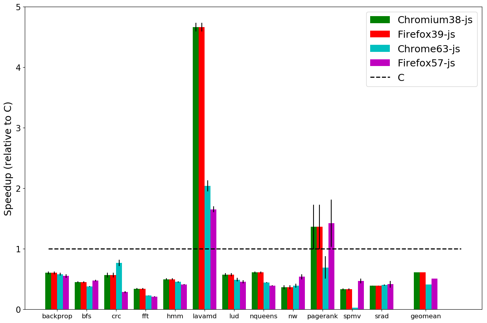

 ## WebAssembly and JavaScript Challenge: Numerical program performance using modern browser technologies and devices
- [Table of Contents](#table-of-contents)
  * [Devices](#devices)
  * [Experiments](#experiments)
    + [RQ1: Old versus New JavaScript Engines](#rq1-old-versus-new-javascript-engines)
    + [RQ2: JavaScript versus WebAssembly](#rq2-javascript-versus-webassembly)
    + [RQ3: Portable versus Vendor-specific Browsers](#rq3-portable-versus-vendor-specific-browsers)
    + [RQ4: Server-side Node.js versus Client-side Browsers](#rq4-server-side-nodejs-versus-client-side-browsers)
    + [RQ5: Best Performers](#rq5--best-performers)
  * [Raw Timings](#raw-timings)
    + [iPhone 10](#iphone-10)
    + [Samsung S8](#samsung-s8)
    + [Pixel 2](#pixel-2)
    + [Samsung Tab S3](#samsung-tab-s3)
    + [iPad Pro](#ipad-pro)
    + [MacBook Pro 2013](#macbook-pro-2013)
    + [Ubuntu Deer](#ubuntu-deer)
    + [Windows Bison](#windows-bison)

## Devices
|name   |cpu    |memory |OS     | GCC | Emscripten| Report | Data|
|----   |---    |-------|-------|-----|-----------|-----------|-----------|
| __DESKTOPS & LAPTOPS__   |    |||||||
|mbp-2013    |  Intel(R) Core(TM) i5 @ 2.4 GHz   |  8 GB 1600 MHz DDR3      |   macOS High Sierra 10.13.1 |llvm-gcc 4.2.1   |1.37.22 |[report](./raw-data/mbp2013/report-mbp2013.md) |[mbp2013.csv](./raw-data/mbp2013/browser/platform=mbp2013,input-size=medium.csv) |
|ubuntu-deer    |Intel(R) Core(TM) i7-3820 CPU @ 3.60GHz     |  16 GB     |   Ubuntu 16.04 xenial |gcc 5.4.0 |1.37.22  |[report](./raw-data/ubuntu-deer/report-ubuntu-deer.md) | [ubuntu-deer.csv](./raw-data/ubuntu-deer/browser/platform=ubuntu-deer,input-size=medium.csv)|
|windows-bison    |  Intel(R) Core(TM) i7-3820 CPU @ 3.60GHz   | 16 GB |   Windows 10 Enterprise | gcc 6.4.0 cywig  |1.37.22 |[report](./raw-data/windows-bison/report-windows-bison.md) | [windows-bison.csv](./raw-data/windows-bison/browser/platform=windows-bison,input-size=medium.csv)|
| __S. B. Computers__   |    |||||||
| raspberry-pi-3 | 1.2 GHZ quad-core ARM Cortex A53 (ARMv8 Instruction Set) | 1 GB | Linux Raspberry Pi 4.9.35-v7 | gcc 4.9.2 - 10 | 1.37.22 | [report](./raw-data/raspberry-pi-3/report-raspberry-pi-3.md) | [raspberry-pi-3.csv](./raw-data/raspberry-pi-3/server/platform=raspberry3,environment=node-remote-raspberry,input-size=medium.csv)|
| __TABLETS__   |    |||||||
| ipad-pro | 2.36 GHz hexa-core Apple Fusion (3× Hurricane + 3× Zephyr) | 4GB  | OS 11.0.3 (15A432) | - | 1.37.22 |[report](./raw-data/ipad-pro/report-ipad-pro.md) | [ipad-pro.csv](./raw-data/ipad-pro/browser/platform=ipad-pro,input-size=medium.csv) |
| samsung-tab-s3|2.15GHz - 1.6Ghz Quad Core Processor | 4GB  | android 8.0.0 | - |  1.37.22 |[report](./raw-data/samsung-tab-s3/report-samsung-tab-s3.md) | [samsung-tab-s3.csv](./raw-data/samsung-tab-s3/browser/platform=samsung-tab-s3,input-size=medium.csv) |
| __SMART PHONES__   |    |||||||
| sumsung8 | Octa-core (2.3GHz Quad + 1.7GHz Quad), 64 bit, 10nm processor | 4GB | android 8.0.0 | - | 1.37.22| [report](./raw-data/samsung8/report-samsung8.md) | [sumsung8.csv](./raw-data/samsung8/browser/platform=samsung8,input-size=medium.csv) |
| pixel2  | Qualcomm MSM8998 Snapdragon 835, Octa-core (4x2.35 GHz Kryo & 4x1.9 GHz Kryo) | 4 GB | android 8.0.0 | - | 1.37.22|[report](./raw-data/pixel2/report-pixel2.md) | [pixel2.csv](./raw-data/pixel2/browser/platform=pixel2,input-size=medium.csv) |
| iphone8 | 2.36 GHz hexa-core Apple Fusion (3× Hurricane + 3× Zephyr)| 4GB | OS 11.0.3 | - | 1.37.22 | [report](./raw-data/iphone10/report-iphone10.md) | [iphone10.csv](./raw-data/pixel2/browser/platform=iphone10,input-size=medium.csv) |

## Experiments 

### RQ1 Old versus New JavaScript Engines

> __Conclusion__: The overall performance of JavaScript against native C versions remained within a factor of 2. The current Firefox browser has presented an overall improvement, compared to the older Firefox version. The current Chrome browser, however, has presented a decrease in overall performance compared to the older Chrome version.

__Figure 2__. JavaScript Performance of the MacBook Pro 2013 laptop against native C, using the old and current versions for Chrome and Firefox

__Figure 3__. JavaScript Performance of Ubuntu Workstation against native C, using the old and current versions for Chrome and Firefox

### RQ2 JavaScript versus WebAssembly

> __Conclusion__:  All browsers demonstrate significant performance improvements for WebAssembly, in the range of 2x speedups over the same browser’s JavaScript engine. Furthermore, WebAssembly achieves an overall performance close to 1 against native C, achieving an even greater performance for Firefox57 in the ubuntu-deer platform.

__Figure 4__. WebAssembly performance relative to C on the MacBookPro 2013.

__Figure 5__. WebAssembly performance relative to C on the different platforms.

__Figure 6__. WebAssembly performance relative to JavaScript on the different platforms.

### RQ3 Portable versus Vendor-specific Browsers

> __Conclusion__:   In general the performance of the proprietary browsers is close for all the mobile and tablet devices, while presenting some differences in the windows-bison workstation and the mbp2013 laptop, where the proprietary browsers are performing worse overall. Therefore no clear trend of vendors taking advantage of their hardware architecture knowledge has been found.

__Figure 7__. Performance of browsers relative to proprietary respective browsers.

### RQ4 Server-side Node.js versus Client-side Browsers
> __Conclusion__: Node.js was overall slower than native C code for both JavaScript and WebAssembly, although the best WebAssembly gave reasonable performance of 0.8 the speed of native C. Server-side Node.js matched the best browser performance for both JavaScript and WebAssembly for all the devices, except for the ubuntu-deer device.

__Figure 9__: Performance of Node.js in different workstations relative to C.

__Table 6__: Browser speedup performance relative to their respective WebAssembly and JavaScript Node.js versions for each device.

|__Device__ |Chromium 63 JS | Chromium 63 -wasm-c  | Firefox-57 -js| Firefox57 -wasm-c |Safari11-js|Safari- wasm-c|Microsoft -Edge -js|Microsoft -Edge -Wasm-c | Chromium56 -js|
|-----------|---------------|---------------------|--------------|------------------|-----------|-------------|----------------------|-------------------------|--------------|
|mbp2013| 1 | 1 | 0.9 | 0.9 | 1.2 | 1.4| - | - | - |
|windows-bison | 1 | 1.1 | 0.9 | 1 | - | - | 1.5 | 1.1 | - |
| ubuntu-deer | 0.6 | 0.5 | 0.4 | 0.4 | - | - | - | - | - | 
| raspberry-pi | - | - | - | - | - | - | - | - | 1.1 |

### RQ5 Best Performers
> __Conclusion__: The best overall browser performance was by the Firefox 57 browser, the order of device performance has the two workstations first, surprisingly followed by the iPhone 10, the rest of the order is: MacBook Pro 2013 laptop, iPad Pro, Samsung S8, Pixel 2, Samsung Tab S3 and lastly, Raspberry Pi Model B.

__Table 7__: Device performance across environments using the native C raspberry pi implementation as baseline for geometric means.

## Raw Timings
### iPhone 10
__Figure 1__: Timing in seconds for the Apple iPhone 10

### Samsung S8
__Figure 2__: Timing in seconds for the Samsung S8

### Pixel 2
__Figure 3__: Timing in seconds for the Google Pixel 2

### Samsung Tab S3
__Figure 4__: Timing in seconds for the Samsung Tab S3

### iPad Pro
__Figure 5__: Timing in seconds for the iPad Pro

### MacBook Pro 2013
__Figure 6__: Timing in seconds for the MacBook Pro 2013

### Ubuntu Deer
__Figure 7__: Timing in seconds for the ubuntu-deer

### Windows Bison
__Figure 8__: Timing in seconds for the windows-bison

